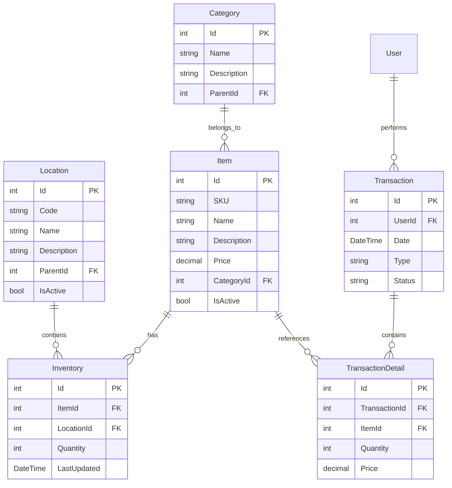

# Storeit Inventory Management System - System Design

## Table of Contents
1. [System Overview](#1-system-overview)
2. [Architecture](#2-architecture)
3. [Core Components](#3-core-components)
4. [Data Model](#4-data-model)
5. [API Design](#5-api-design)
6. [Security](#6-security)
7. [Performance Considerations](#7-performance-considerations)
8. [Scalability](#8-scalability)
9. [Deployment Strategy](#9-deployment-strategy)
10. [Monitoring & Maintenance](#10-monitoring--maintenance)

## 1. System Overview

### 1.1 Purpose
Storeit is a configurable Inventory Management System designed for small to medium-sized businesses. It provides comprehensive inventory tracking, storage location management, and reporting capabilities.

### 1.2 Key Features
- Inventory tracking and management
- Configurable storage locations
- QR/barcode scanning
- Real-time inventory updates
- Reporting and analytics
- Multi-user support
- Role-based access control
- Audit logging

### 1.3 Target Users
- Warehouse managers
- Inventory clerks
- Business owners
- System administrators

## 2. Architecture

### 2.1 System Architecture
```plaintext
┌─────────────────┐     ┌─────────────────┐     ┌─────────────────┐
│                 │     │                 │     │                 │
│  WPF Desktop    │◄───►│  Web API Layer  │◄───►│  Data Access   │
│  Application    │     │                 │     │    Layer        │
│                 │     │                 │     │                 │
└─────────────────┘     └─────────────────┘     └─────────────────┘
        ▲                        ▲                        ▲
        │                        │                        │
        ▼                        ▼                        ▼
┌─────────────────┐     ┌─────────────────┐     ┌─────────────────┐
│                 │     │                 │     │                 │
│  User Interface │     │  Business Logic │     │  Database Layer │
│                 │     │                 │     │                 │
└─────────────────┘     └─────────────────┘     └─────────────────┘
```

### 2.2 Technology Stack
- **Frontend**: WPF (.NET 8)
- **Backend**: .NET 8 Web API
- **Database**: PostgreSQL 16 (Primary), SQLite (Local)
- **Authentication**: JWT + Windows Authentication
- **Logging**: Serilog + Seq
- **Monitoring**: Application Insights

## 3. Core Components

### 3.1 Desktop Application (Storeit.Desktop)
- WPF-based user interface
- MVVM architecture
- Real-time inventory updates
- Offline capability
- QR/barcode scanning integration

### 3.2 API Layer (Storeit.Api)
- RESTful API endpoints
- Swagger documentation
- Authentication/Authorization
- Request validation
- Rate limiting

### 3.3 Business Logic (Storeit.Core)
- Domain models
- Business rules
- Validation logic
- Service interfaces
- Event handling

### 3.4 Data Access (Storeit.Data)
- Repository pattern
- Entity Framework Core
- Database migrations
- Caching layer
- Unit of Work pattern

## 4. Data Model

### 4.1 Core Entities


### 4.2 Database Schema
- PostgreSQL for production
- SQLite for local development
- Entity Framework Core migrations
- Indexed fields for performance
- Soft delete implementation

## 5. API Design

### 5.1 RESTful Endpoints
```plaintext
/api/v1/items
├── GET    /              # List items
├── GET    /{id}          # Get item details
├── POST   /              # Create item
├── PUT    /{id}          # Update item
└── DELETE /{id}          # Delete item

/api/v1/inventory
├── GET    /              # List inventory
├── GET    /{id}          # Get inventory details
├── POST   /              # Add inventory
├── PUT    /{id}          # Update inventory
└── POST   /transfer      # Transfer inventory

/api/v1/locations
├── GET    /              # List locations
├── GET    /{id}          # Get location details
├── POST   /              # Create location
├── PUT    /{id}          # Update location
└── DELETE /{id}          # Delete location
```

### 5.2 API Versioning
- URL-based versioning (/api/v1/)
- Semantic versioning
- Backward compatibility
- Deprecation policy

## 6. Security

### 6.1 Authentication
- JWT-based authentication
- Windows Authentication integration
- Refresh token mechanism
- Password policies
- Two-factor authentication (optional)

### 6.2 Authorization
- Role-based access control (RBAC)
- Permission-based authorization
- Resource-level access control
- Audit logging

### 6.3 Data Security
- Encrypted connections (TLS)
- Data encryption at rest
- Secure password storage
- Input validation
- SQL injection prevention

## 7. Performance Considerations

### 7.1 Caching Strategy
- In-memory caching
- Distributed caching
- Cache invalidation
- Cache warming

### 7.2 Database Optimization
- Index optimization
- Query optimization
- Connection pooling
- Batch operations

### 7.3 Application Performance
- Async/await patterns
- Background processing
- Resource pooling
- Memory management

## 8. Scalability

### 8.1 Horizontal Scaling
- Load balancing
- Database sharding
- Caching distribution
- Session management

### 8.2 Vertical Scaling
- Resource optimization
- Connection pooling
- Memory management
- CPU utilization

## 9. Deployment Strategy

### 9.1 Development Environment
- Local development setup
- Docker containers
- Automated testing
- CI/CD pipeline

### 9.2 Production Environment
- High availability setup
- Load balancing
- Database replication
- Backup strategy

## 10. Monitoring & Maintenance

### 10.1 Logging
- Application logging
- Error tracking
- Performance metrics
- Audit trails

### 10.2 Monitoring
- Application Insights
- Custom dashboards
- Alerting system
- Performance monitoring

### 10.3 Maintenance
- Regular updates
- Backup procedures
- Disaster recovery
- Performance tuning

## Appendix

### A. Development Guidelines
- Coding standards
- Git workflow
- Code review process
- Testing requirements

### B. API Documentation
- Swagger UI
- Postman collection
- Example requests
- Error codes

### C. Database Documentation
- Schema documentation
- Index strategy
- Query optimization
- Backup procedures 