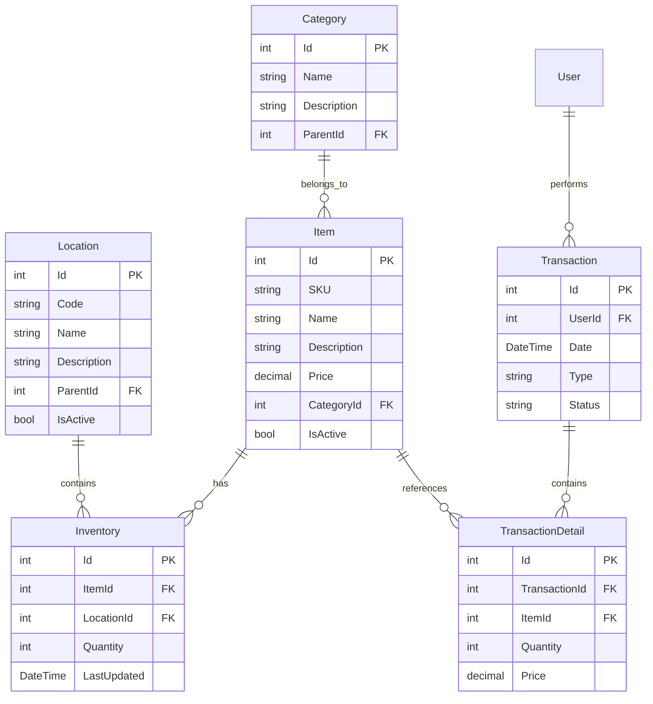

# Storeit Inventory Management System - System Design

## Table of Contents
1. [System Overview](#1-system-overview)
2. [Architecture](#2-architecture)
3. [Core Components](#3-core-components)
4. [Data Model](#4-data-model)
5. [API Design](#5-api-design)
6. [Security](#6-security)
7. [Performance Considerations](#7-performance-considerations)
8. [Scalability](#8-scalability)
9. [Deployment Strategy](#9-deployment-strategy)
10. [Monitoring & Maintenance](#10-monitoring--maintenance)

## 1. System Overview

Storeit is a comprehensive inventory management system designed for mid-sized retail chains, manufacturing SMEs, and distribution companies. The system follows a local-first architecture with optional cloud synchronization capabilities.

## 2. Architecture

### Core Components

1. **Desktop Application (.NET MAUI)**
   - Primary user interface
   - Local data storage (SQLite)
   - Offline-first operation
   - Local API server for mobile integration
   - Backup and restore capabilities

2. **Mobile Application (React Native/Flutter)**
   - Barcode/QR scanning
   - Inventory checks
   - Basic analytics
   - Work order management
   - Local-first with sync capabilities

3. **Central Monitoring Server**
   - System health monitoring
   - Module update distribution
   - Troubleshooting support
   - Anonymous usage statistics (opt-in)

### Data Flow

```
[Mobile App] ←→ [Desktop App (Local Server)] ←→ [Central Monitoring Server]
                        ↑
                    [SQLite]
```

## Technical Stack

### Desktop Application
- Framework: .NET MAUI
- Database: SQLite
- Local API: ASP.NET Core
- Backup System: Custom implementation
- Security: Local authentication and encryption

### Mobile Application
- Framework: React Native/Flutter
- Local Storage: SQLite/Realm
- Network: Local API integration
- Security: Local authentication

### Central Server
- Framework: Node.js/Express
- Database: PostgreSQL (for monitoring only)
- API: RESTful endpoints
- Security: JWT authentication

## Data Management

### Local Storage
- SQLite database for all business data
- Encrypted storage for sensitive information
- Local backup system with multiple storage options
- Automatic backup scheduling

### Synchronization
- Hybrid sync model (local-first with cloud option)
- Conflict resolution strategies
- Automatic sync when online
- Manual sync options

## Security

### Local Security
- Local user authentication
- Role-based access control
- Data encryption at rest
- Secure local API communication

### Backup Security
- Encrypted backups
- Multiple backup locations
- Backup validation
- Automatic backup scheduling

## Monitoring and Updates

### System Monitoring
- Local health checks
- Performance monitoring
- Error tracking
- Usage statistics

### Module Updates
- Centralized update distribution
- Update validation
- Rollback capabilities
- Version management

## Backup and Restore

### Backup System
- Full system backups
- Incremental backups
- Multiple backup locations
- Backup scheduling
- Backup validation

### Restore System
- System restore capabilities
- Data restore options
- Configuration restore
- Validation checks

## Mobile Integration

### Local Network
- Automatic server discovery
- Secure local communication
- Offline operation support
- Data synchronization

### Features
- Barcode/QR scanning
- Inventory management
- Work order processing
- Analytics viewing
- MIS reporting

## Deployment

### Desktop Application
- Windows installer
- macOS package
- Linux package
- Automatic updates

### Mobile Application
- App Store distribution
- Play Store distribution
- Enterprise distribution
- Automatic updates

## Future Considerations

### Cloud Integration
- Optional cloud sync
- Hybrid operation modes
- Data migration tools
- Cloud backup options

### Scalability
- Multi-location support
- Distributed operations
- Performance optimization
- Resource management

## 3. Core Components

### 3.1 Desktop Application (Storeit.Desktop)
- WPF-based user interface
- MVVM architecture
- Real-time inventory updates
- Offline capability
- QR/barcode scanning integration

### 3.2 API Layer (Storeit.Api)
- RESTful API endpoints
- Swagger documentation
- Authentication/Authorization
- Request validation
- Rate limiting

### 3.3 Business Logic (Storeit.Core)
- Domain models
- Business rules
- Validation logic
- Service interfaces
- Event handling

### 3.4 Data Access (Storeit.Data)
- Repository pattern
- Entity Framework Core
- Database migrations
- Caching layer
- Unit of Work pattern

## 4. Data Model

### 4.1 Core Entities


### 4.2 Database Schema
- PostgreSQL for production
- SQLite for local development
- Entity Framework Core migrations
- Indexed fields for performance
- Soft delete implementation

## 5. API Design

### 5.1 RESTful Endpoints
```plaintext
/api/v1/items
├── GET    /              # List items
├── GET    /{id}          # Get item details
├── POST   /              # Create item
├── PUT    /{id}          # Update item
└── DELETE /{id}          # Delete item

/api/v1/inventory
├── GET    /              # List inventory
├── GET    /{id}          # Get inventory details
├── POST   /              # Add inventory
├── PUT    /{id}          # Update inventory
└── POST   /transfer      # Transfer inventory

/api/v1/locations
├── GET    /              # List locations
├── GET    /{id}          # Get location details
├── POST   /              # Create location
├── PUT    /{id}          # Update location
└── DELETE /{id}          # Delete location
```

### 5.2 API Versioning
- URL-based versioning (/api/v1/)
- Semantic versioning
- Backward compatibility
- Deprecation policy

## 6. Security

### 6.1 Authentication
- JWT-based authentication
- Windows Authentication integration
- Refresh token mechanism
- Password policies
- Two-factor authentication (optional)

### 6.2 Authorization
- Role-based access control (RBAC)
- Permission-based authorization
- Resource-level access control
- Audit logging

### 6.3 Data Security
- Encrypted connections (TLS)
- Data encryption at rest
- Secure password storage
- Input validation
- SQL injection prevention

## 7. Performance Considerations

### 7.1 Caching Strategy
- In-memory caching
- Distributed caching
- Cache invalidation
- Cache warming

### 7.2 Database Optimization
- Index optimization
- Query optimization
- Connection pooling
- Batch operations

### 7.3 Application Performance
- Async/await patterns
- Background processing
- Resource pooling
- Memory management

## 8. Scalability

### 8.1 Horizontal Scaling
- Load balancing
- Database sharding
- Caching distribution
- Session management

### 8.2 Vertical Scaling
- Resource optimization
- Connection pooling
- Memory management
- CPU utilization

## 9. Deployment Strategy

### 9.1 Development Environment
- Local development setup
- Docker containers
- Automated testing
- CI/CD pipeline

### 9.2 Production Environment
- High availability setup
- Load balancing
- Database replication
- Backup strategy

## 10. Monitoring & Maintenance

### 10.1 Logging
- Application logging
- Error tracking
- Performance metrics
- Audit trails

### 10.2 Monitoring
- Application Insights
- Custom dashboards
- Alerting system
- Performance monitoring

### 10.3 Maintenance
- Regular updates
- Backup procedures
- Disaster recovery
- Performance tuning

## Appendix

### A. Development Guidelines
- Coding standards
- Git workflow
- Code review process
- Testing requirements

### B. API Documentation
- Swagger UI
- Postman collection
- Example requests
- Error codes

### C. Database Documentation
- Schema documentation
- Index strategy
- Query optimization
- Backup procedures 